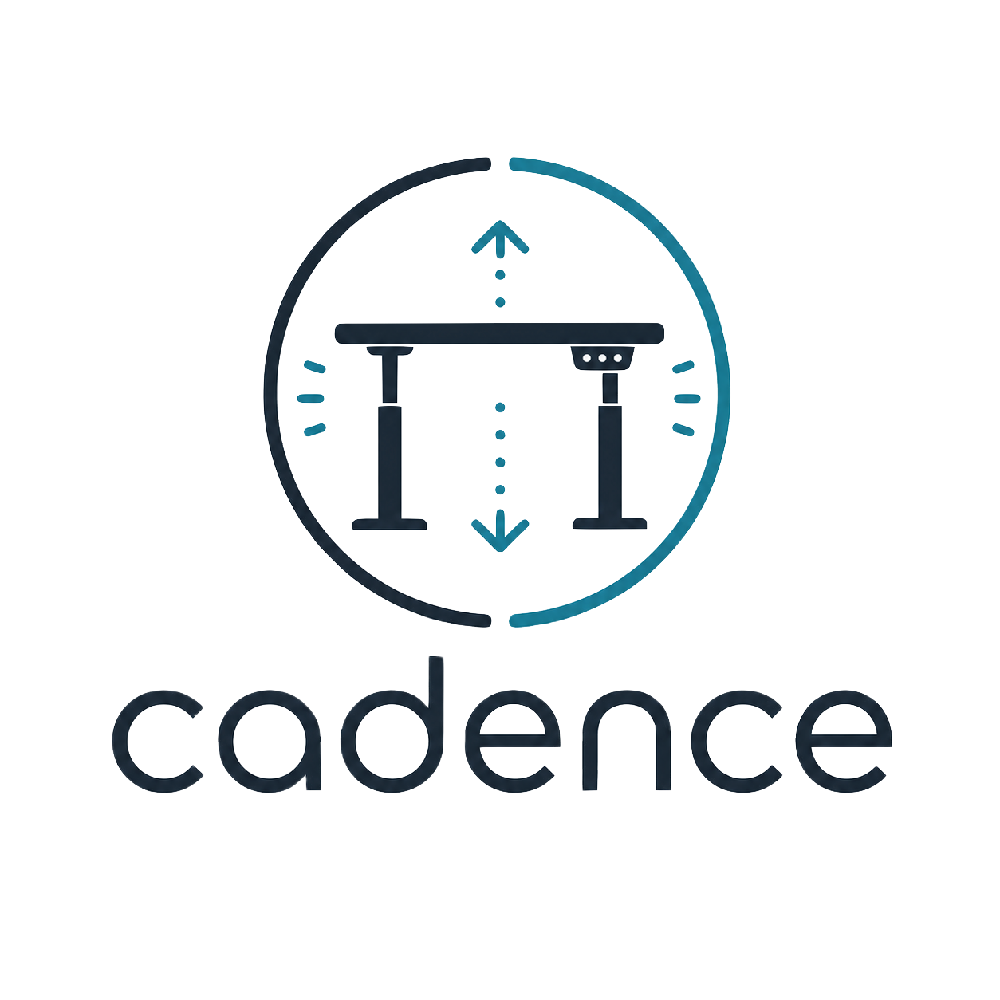

<p align="center">
  <picture>
    <source media="(prefers-color-scheme: dark)" srcset="assets/logo-dark.png">
    
  </picture>
</p>

<p align="center"><em>I sit too long. You probably do too.</em></p>

cadence is a sit/stand captain for my **Deskhaus Apex Pro**: a local daemon
that talks to the desk over Bluetooth LE and alternates between my saved
sitting and standing heights on a schedule. The goal was a captain, not a
dumb timer. It warns before it moves (desktop notification, plus a physical
"knock" where the desk nudges up and back), it notices when I move the desk
myself and adapts, and it knows when I've walked away so it doesn't spend all
night doing desk calisthenics for an empty chair.

> ⚠️ **This moves physical furniture.** Start in the safe default mode
> (notification warnings, no auto-movement until armed) and prove manual
> control works before letting the daemon move anything.

## Status

Working, and running my actual desk right now. Every protocol claim in this
repo (height polling and decoding, continuous up/down, absolute moves,
warning taps, collision behavior) was verified live against the desk, not
copied from a spec. The findings, including the weird ones, live at the top
of [`src/cadence/protocol.py`](src/cadence/protocol.py).

## Will it work with my desk?

Maybe! Any desk built on a Jiecang BLE controller (Uplift's BLE adapter,
AiDesk-compatible desks, a pile of white-label brands) likely speaks the same
frame protocol. `cadence scan` looks for the known service UUIDs (`fe60`,
`ff00`, `ff12`) and picks the command/notify characteristics for you.

But verify before you trust it. Firmware variants lie in ways that matter:
my desk reports heights in 0.1-inch units while accepting move targets in
millimeters, and the community docs swore both were 0.1mm. `cadence setup`
walks you through this interactively and unlocks absolute moves when the
checks pass. The manual version of the same order:

1. `cadence scan`: find the desk, save its identity to config.
2. `cadence status`: confirm the reported height matches the desk display.
3. `cadence up` then `cadence stop`: one supervised nudge, confirm direction.
4. `cadence goto <near current height>`: small move, confirm it lands right.
5. Only then enable the daemon, and keep `require_manual_enable_on_start`.

If your desk does something different, open an issue with your `cadence scan`
output and a few captured frames. The protocol layer is built to absorb
variants.

## Install

Requires Python 3.13+ and [`uv`](https://docs.astral.sh/uv/). On macOS, grant
your terminal Bluetooth permission (System Settings → Privacy & Security →
Bluetooth) the first time you scan.

```bash
uv sync                       # create the venv and install deps
uv run cadence --help         # run without installing globally
# or install the CLI on PATH:
uv tool install --editable .
```

## Quick start

```bash
cadence init-config           # write ~/.config/cadence/config.toml
cadence scan                  # find the desk, save its BLE address
cadence setup                 # supervised verification wizard (required once)
cadence status                # connect + read current height
cadence goto 26.8             # move to sitting height (safety-checked)
cadence goto 44.9             # move to standing height
```

`cadence setup` walks the bring-up checklist from above interactively: it checks
the height decoding against your desk's display (and fixes the unit scale if
they disagree), runs one supervised nudge, then one small verified absolute
move. Absolute moves and the daemon are locked until a desk passes it, and
scanning a different desk resets the lock. `goto --force` exists if you've
proven the protocol yourself.

### Calibrate (recommended)

My desk's display has been miscalibrated before, so cadence never trusts it.
Put the desk at a height you've measured with an actual tape measure, then:

```bash
cadence calibrate 26.8        # maps the current raw reading to 26.8 inches
```

## The captain (scheduler)

```bash
cadence daemon                # run in foreground (logs to ~/.local/state/cadence/)
cadence resume                # arm automation
cadence pause                 # kill switch: stop automating, leave desk as-is
cadence next                  # force the next sit<->stand transition now
cadence snooze 15             # snooze automation 15 minutes
cadence status                # posture, phase timer, presence, manual-move state
```

Run it in the background via launchd:

```bash
./scripts/install-launchd.sh  # loads com.justfielding.cadence
```

The default cycle: **sit 45m → warn → stand → stand 15m → warn → sit → repeat.**
Edit `~/.config/cadence/config.toml` for timing, heights, warning mode, safety
bounds, working hours, and quiet hours. See
[`examples/config.toml`](examples/config.toml).

The captain also watches whether you're actually at the computer, judged by
time since your last keyboard or mouse input. A due move only fires if you've
been active in the last couple of minutes, so a bathroom break doesn't come
back to a surprise standing desk. Gone longer and the cycle holds entirely;
come back and the current phase restarts instead of firing an overdue move at
you the second the mouse twitches. Keep-awake apps like Caffeine don't
confuse this check... they keep the display on, but they don't fake input.
Configure under `[presence]`.

For a desk that shares a room with people asleep, `[quiet_hours]` carves out a
nightly window where it never moves (the desk is quiet, but not silent). It's
off by default; enable it and set `start`/`end` — the window wraps midnight, so
`22:00`–`07:00` does what you'd expect. Unlike working hours, this holds even
when the schedule otherwise runs around the clock. When the window lifts the
captain eases back in: it re-reads your posture and restarts the phase instead
of slamming the desk the instant quiet hours end.

## Safety model

It moves furniture, so it's paranoid by design:

- Never moves outside `[min_height_inches, max_height_inches]` (targets are clamped).
- Refuses absolute moves when the current height can't be read.
- Won't move while the desk is already moving.
- Detects manual moves (a height change it didn't command), resets the timer,
  and honors a grace period before automating again.
- Verifies the desk actually moved after every command instead of trusting
  the controller's acknowledgement (it lies, see Troubleshooting).
- A move that settles far from its target is treated as a collision: notify
  and back off, never retry into an obstruction.
- Warnings default to a desktop notification + sound. The physical tap is
  opt-in (`warning.mode = "tap"` or `"both"`) and only runs when height is known.
- Every automatic move is logged with timestamp, from/to height, and reason.

## Architecture

```
src/cadence/
  cli.py          typer CLI (all commands)
  config.py       TOML config (dataclasses, load/save)
  paths.py        XDG config/state/log locations
  protocol.py     Jiecang/Uplift frame encode/decode + calibration math
  ble.py          bleak transport: scan, inspect, DeskClient
  safety.py       movement guardrails (check_move)
  notify.py       macOS desktop notification + sound
  presence.py     HID idle probe (is anyone actually here?)
  scheduler.py    pure decide() + Captain executor + daemon run()
  state.py        state.json blackboard (CLI <-> daemon)
tests/            protocol + scheduler/safety unit tests (no hardware)
scripts/          launchd installer
examples/         default config
```

The protocol details (UUIDs, opcodes, frame format) and the BLE references
that informed them are documented at the top of `src/cadence/protocol.py`.

## Troubleshooting

**Connection keeps dropping (reconnects every few minutes).** Another BLE
central is fighting cadence for the desk. For me it was my phone: the AiDesk
app kept auto-reconnecting in the background and yanking the link every few
minutes. Close the vendor app or turn off Bluetooth on phones/tablets that
have paired with the desk. The daemon detects the pattern (3+ drops in 10
minutes) and sends a notification with the same advice. Isolated drops are
normal BLE life; the daemon reconnects within ~30 seconds and the schedule
is unaffected.

**Desk ignores movement commands but height still updates.** Known controller
quirk on long-lived connections: the desk keeps ACKing writes and reporting
height while playing dead on movement. The daemon handles it by verifying
motion after every command and reconnecting if the desk went deaf.

## Development

```bash
uv run pytest                 # unit tests (pure logic, no desk required)
```

## Roadmap

- `cadence report`: paste-ready GATT + frame dump for compatibility issues.
- Cross-platform notifications (currently macOS `osascript`/`afplay`) and a
  systemd unit example alongside launchd.
- Driver abstraction for non-Jiecang controllers (Linak-based Jarvis/Fully).
- Maybe a Rust rewrite (`btleplug`) once the novelty of the Python one wears off.

## License

MIT. See [LICENSE](LICENSE).
